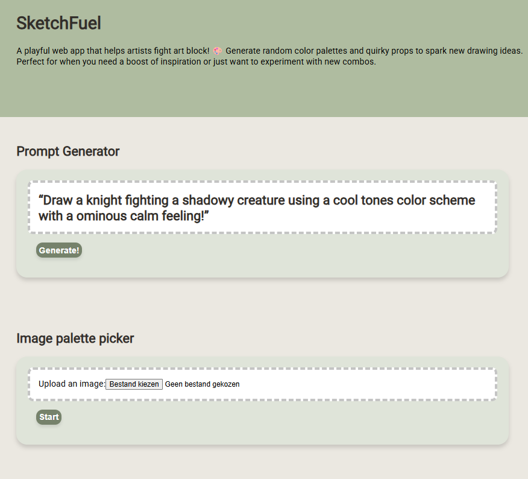

Got it — here’s an updated version of your README with the **Express backend** included and the structure tightened a bit for clarity:

---

# 🎨 SketchFuel

A playful web app that helps artists break through art block.

Generate random color palettes and quirky prop ideas to spark inspiration, experiment with unexpected combinations, and kickstart your next drawing.

Built with **Angular (frontend)** and **Express (backend)**.

---

## ✨ Preview




---

## 🏗️ Tech Stack

* 🅰️ Angular (Frontend)
* 🟢 Node.js + Express (Backend)
* 🎨 Random palette + idea generation system
* ⚡ REST API communication between client and server

---

## 🚀 Getting Started

### 1. Install dependencies

Frontend:

```bash
npm install
```

Backend:

```bash
cd backend
npm install
```

---

### 2. Run the backend

```bash
cd backend
npm run dev
```

---

### 3. Run the frontend

In a separate terminal:

```bash
ng serve
```

Then open:

```
http://localhost:4200/
```

The app will auto-reload on changes.

---

## 🧩 Features

* 🎨 Random color palette generator
* 🎲 Quirky prop / drawing idea generator
* 🔌 Angular ↔ Express API integration
* 💡 Designed to fight art block and boost creativity

---

## 🛠️ Development

### Generate a new Angular component

```bash
ng generate component component-name
```

### Explore schematics

```bash
ng generate --help
```

---

## 📦 Build

### Frontend production build

```bash
ng build
```


## 🧪 Testing

### Unit tests

```bash
ng test
```
